## 📝 Planejamento de Testes Funcionais

### Nome do Projeto:

- **API Cinema - Rotas Movies e Tickets**

### ✏️ Resumo:
Este plano de teste visa validar as rotas de movies e tickets da API Cinema, cobrindo operações de CRUD. O foco é garantir o funcionamento correto das funcionalidades, incluindo **criar, listar, atualizar e excluir** registros, além de assegurar a validação dos dados, autenticação e segurança, garantindo que os requisitos de negócio sejam atendidos e prevenindo acessos indevidos.

---
### 🙍 Pessoas Envolvidas:

Thaise Chaves Zanin - **QA**

---
### ⚙️ Funcionalidades ou Módulos a serem testados:

### /movies

- Criar um novo filme.

- Listar todos os filmes.

- Buscar um filme específico.

- Atualizar um filme.

- Remover um filme.

### /tickets

- Criar um novo ticket.

- Listar todos os tickets.

- Buscar um ticket pelo ID.

- Atualizar um ticket.

- Remover um ticket.

---

### 📍 Local de Testes:

- Ambiente de Teste: **[API Cinema](http://localhost:3000/api/docs)**

---
### 🔨 Recursos Necessários:

- **Ferramentas:** GitHub, Visual Studio Code, K6, Jira, Miro, Postman, AWS EC2, Docker;

- **Ambiente configurado com acesso à API.**

---
### 📎 Critérios Usados:

### 🎥 Movies

- **Criar Filme:** Usuário administrador envia POST para /movies com detalhes. O sistema valida os dados, cria o filme com ID único e retorna 201 Created.

- **Listar Filmes:** Usuário envia GET para /movies. O sistema retorna a lista de filmes cadastrados.

- **Listar Filme por ID:** Usuário envia GET para /movies/{id}. Se existir, retorna detalhes; se não, retorna 404 Not Found.

- **Atualizar Filme:** Usuário administrador envia PUT para /movies/{id}. Se válido, atualiza os detalhes e retorna 200 OK.

- **Excluir Filme:** Usuário administrador envia DELETE para /movies/{id}. Se existir, remove e retorna 204 No Content.

### 🎟️ Tickets

- O usuário envia uma solicitação POST para o endpoint /tickets com os seguintes detalhes do ingresso: **ID do Filme (movieId)**, **ID do Usuário (userId)**, **Número do Assento (seatNumber)**, **Preço do Ingresso (price)** e **Data de Apresentação (showtime)**.

- O sistema valida se todos os campos obrigatórios estão preenchidos corretamente.

- O sistema verifica se o número do assento está dentro do intervalo de 0 a 99.

- O sistema verifica se o preço do ingresso está dentro do intervalo de 0 a 60.

- Se todas as validações passarem, o sistema cria uma reserva de ingresso com os detalhes fornecidos.

- O sistema atribui um ID único à reserva de ingresso.

- O sistema retorna uma resposta de sucesso com o status 201 Created, incluindo o ID da reserva de ingresso 

---
### 📛 Riscos:

- **Erros na API:** Possibilidade de falhas que causem indisponibilidade ou comportamento inesperado.

- **Documentação:** Desatualização ou informações insuficientes que prejudiquem o desenvolvimento e manutenção.

---
### ⏱️ Cronograma:
O cronograma seguido foi da Sprint 08 do dia 24/02 ao dia 12/03.

---
### ✔️ Como os Resultados dos Testes Serão Divulgados:

Relatórios detalhados no GitHub;

Screenshots dos resultados;

Apresentação final.

---

### 📝 Estratégias de Teste

**Testes Positivos:** Verificam se a API retorna as respostas esperadas para entradas válidas.

**Testes Negativos:** Simulam entradas inválidas para validar o tratamento de erros.

---
### 🎯 Realização dos Testes no Postman

### 🎥 Movies

❌ O administrador envia um **POST para /movies**, o sistema valida os dados e a unicidade do título, cria o filme com um ID único e retorna 201 Created com o ID. **(Não retornar o ID)**

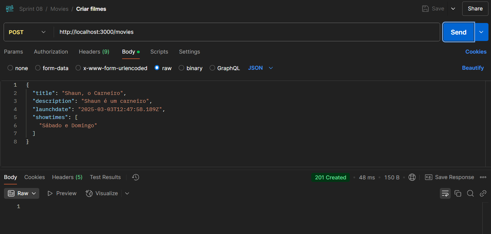

---
✔️ O usuário faz um **GET em /movies**, e o sistema retorna a lista de filmes com detalhes.

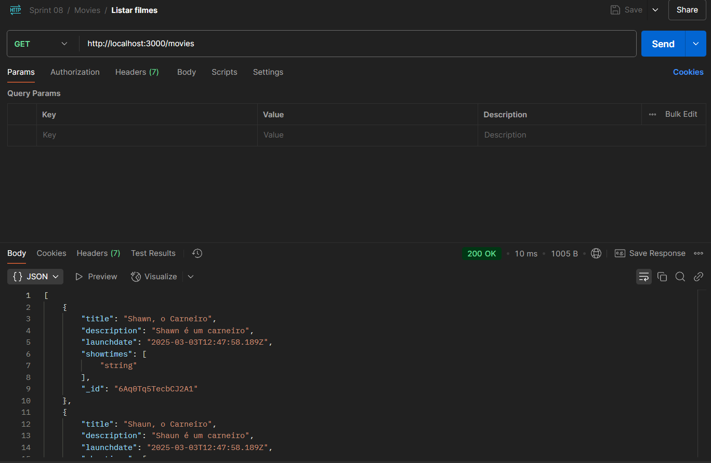

---
✔️ O usuário faz um **GET em /movies/{id}**, e o sistema retorna os detalhes ou 404 se não existir.

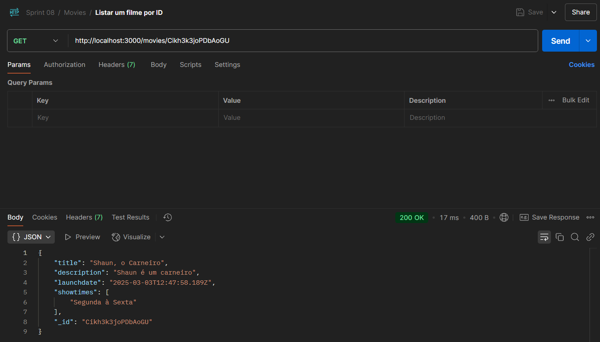

---
✔️ O admin faz um **PUT em /movies/{id}**, o sistema valida, atualiza os detalhes e retorna 200 OK.

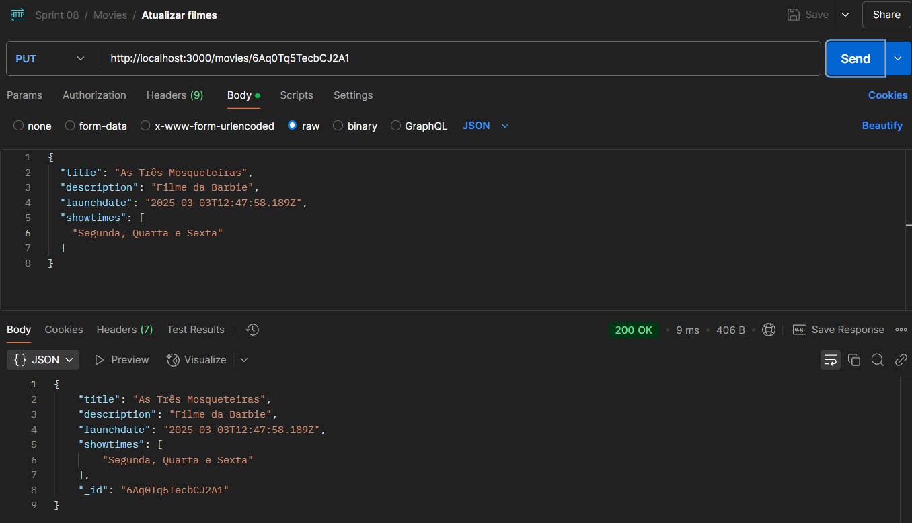

---
❌ O admin faz um **DELETE em /movies/{id}**, o sistema remove o filme e retorna 204 No Content. **(Não retorna 204 No Content)**

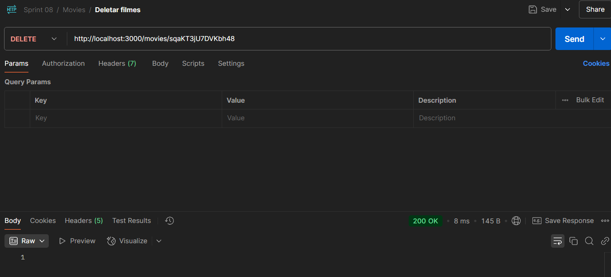

---
### 🎟️ Tickets

✔️ O usuário faz um **POST em /tickets** com **movieId, userId, seatNumber, price e showtime**, o sistema valida os dados, cria a reserva com um ID único e retorna 201 Created.

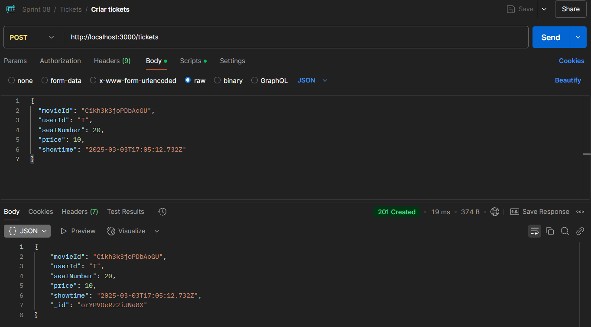

---
✔️ O usuário faz um **GET em /tickets**, e o sistema retorna a lista de tickets com detalhes.

---
❌ Ao tentar realizar um **GET em /tickets{id}**, o sistema **cai**. 

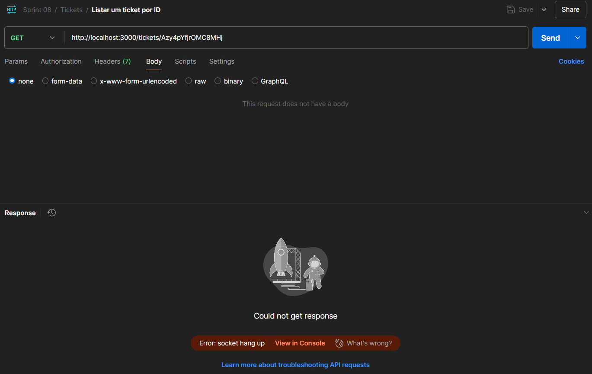

---
❌ Ao tentar realizar um **PUT em /tickets{id}**, o sistema **cai**. 

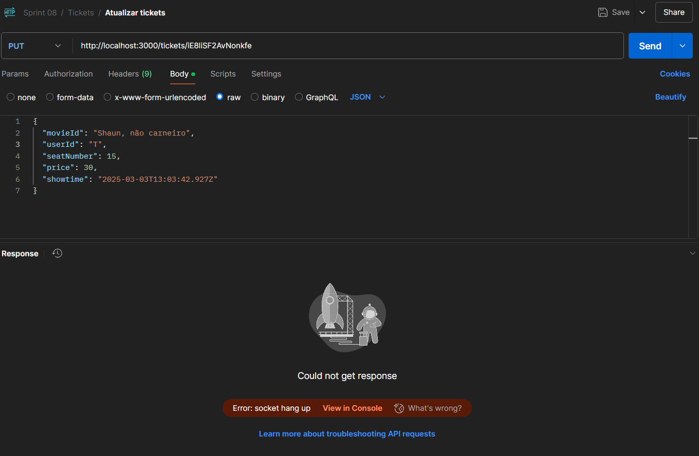

---
❌ Ao tentar realizar um **DELETE em /tickets{id}**, o sistema **cai**.

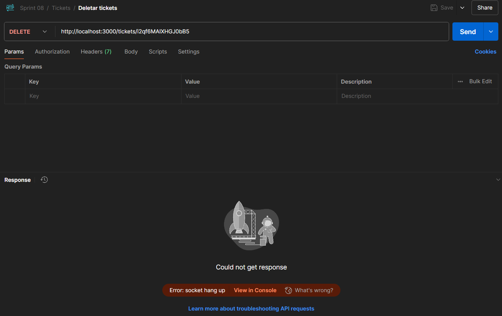

---
### ⚙️ Testes Automatizados:

##### POST Movies - Esse teste verifica status 201, resposta rápida, campos preenchidos, data válida e showtimes não vazios.
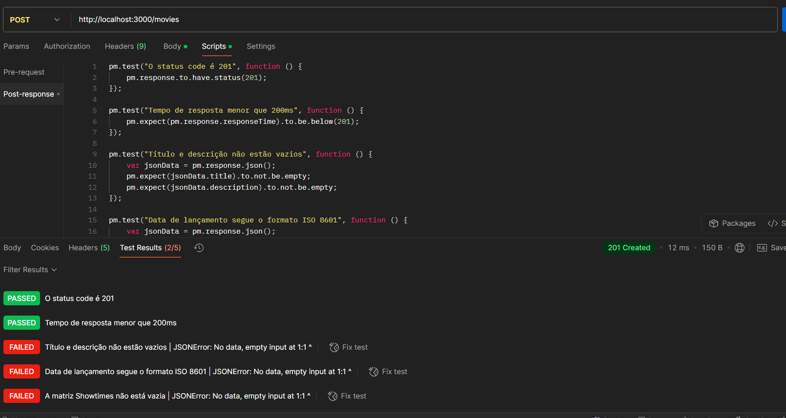

---
##### GET Movies - Esse teste verifica status 200, resposta não vazia e tempo inferior a 200ms.

---

##### POST Tickets - Esse teste verifica status 201, resposta rápida, IDs preenchidos, valores válidos e showtime no formato ISO 8601.

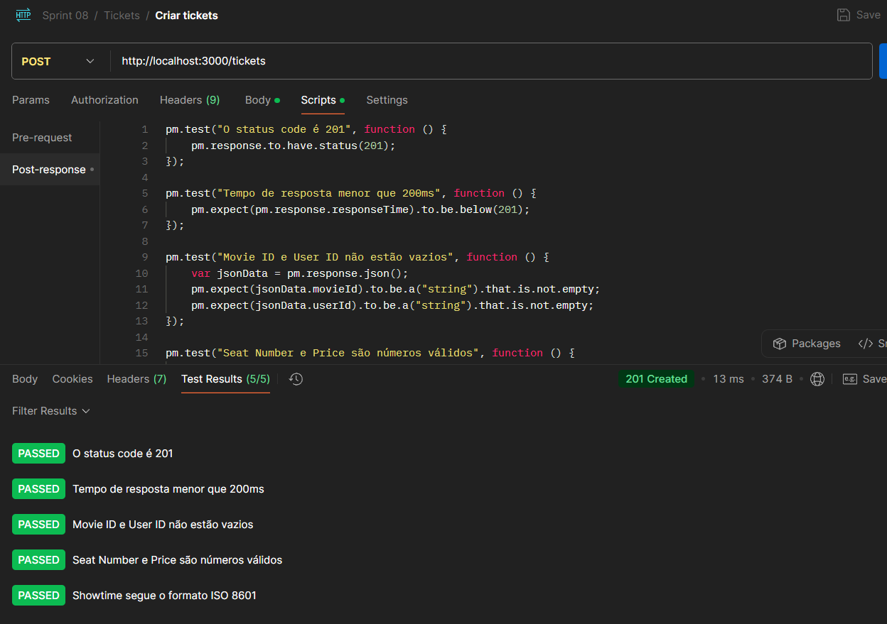

---

##### GET Tickets - Esse teste verifica se a API retorna status 200, resposta não vazia e tempo inferior a 200ms.
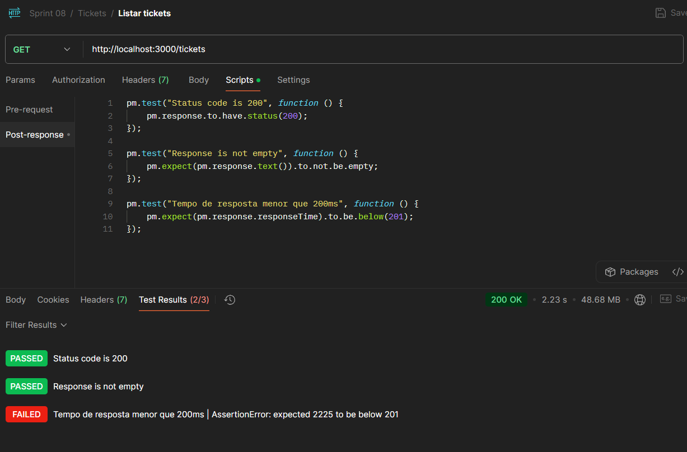

---
### 🐞 Bugs Encontrados:

##### Foi possível criar filmes com o mesmo título e outras informações, embora isso não devesse ser permitido.

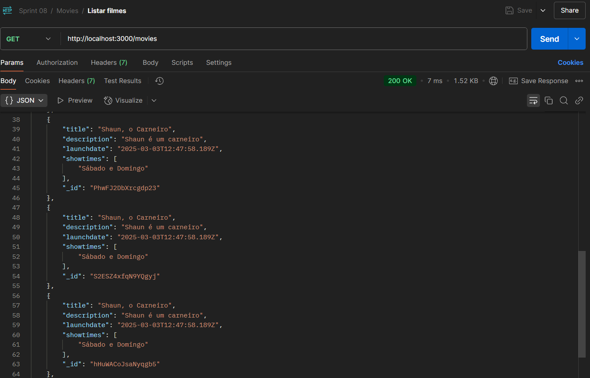

---

##### Foi possível cadastrar um ticket faltando o "movieID".

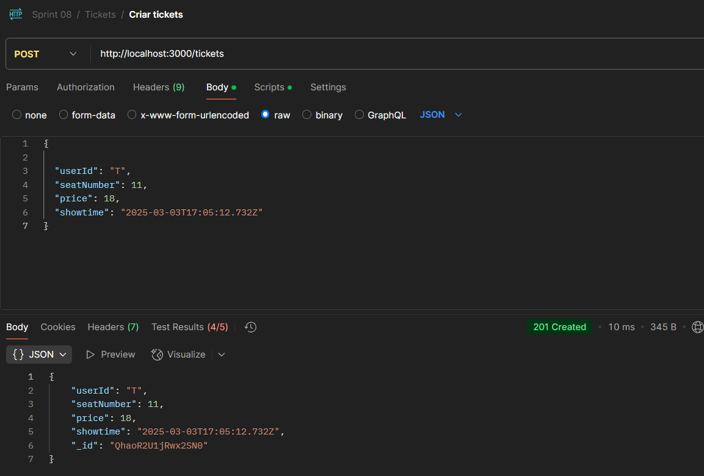

---

##### Foi possível cadastrar um ticket faltando o "userID".

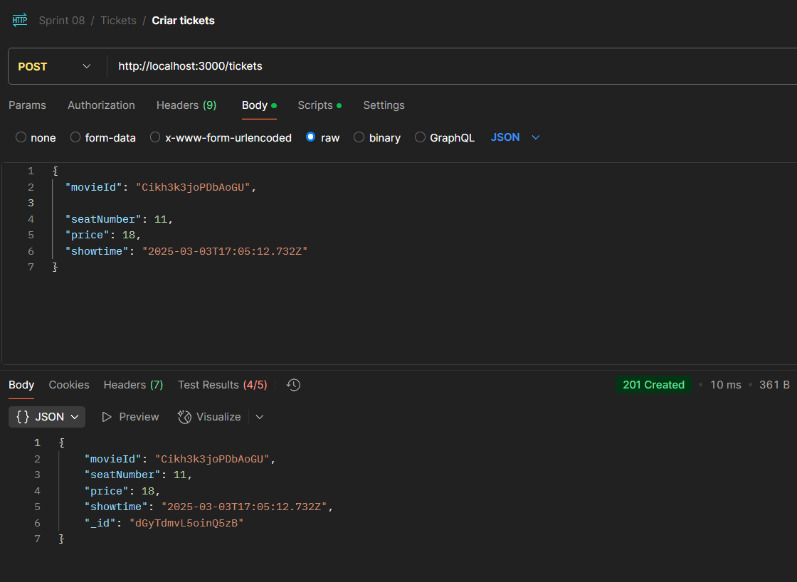

---
### ✅ Sugestão de Melhorias:

- **Evitar Duplicações:** Implementar uma verificação para impedir o cadastro de filmes duplicados e retornar um erro **409 Conflict** em caso de dados idênticos.

- **Mensagem de Exclusão:** Ao excluir um filme, o sistema deve retornar o **status 204 No Content**, acompanhado de uma mensagem de confirmação no corpo da resposta.

- **Mensagens de Confirmação:** Incluir mensagens de confirmação no corpo da resposta para criação de filmes e erros.

---
### 📊 Jira e QAlity

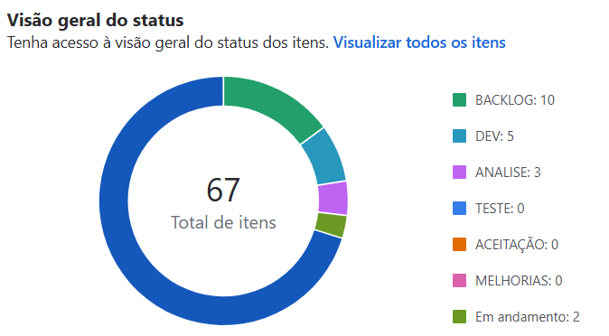

---

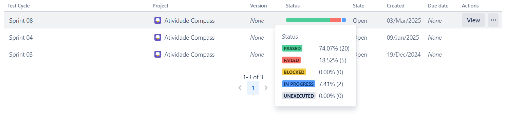