## 📝 Planejamento de Testes Não Funcionais

### Nome do Projeto:

- **API Cinema - Rotas Movies e Tickets**

### ✏️ Resumo:
Este plano de teste visa avaliar o desempenho, segurança e resiliência da API Cinema, focando em testes não funcionais, como **load, stress, soak, spike e smoke**. O objetivo é garantir que o sistema suporte diferentes condições de uso sem comprometer a experiência do usuário ou a integridade dos dados.

---
### 🙍 Pessoas Envolvidas:

Thaise Chaves Zanin - **QA**

---
### ⚙️ Funcionalidades ou Módulos a serem testados:

### /movies

- Criar um novo filme.

- Listar todos os filmes.

- Buscar um filme específico.

- Atualizar um filme.

- Remover um filme.

### /tickets

- Criar um novo ticket.

- Listar todos os tickets.

- Buscar um ticket pelo ID.

- Atualizar um ticket.

- Remover um ticket.

---

### 📍 Local de Testes:

- Ambiente de Teste: **[API Cinema](http://localhost:3000/api/docs)**

---
### 🔨 Recursos Necessários:

- **Ferramentas:** GitHub, Visual Studio Code, K6, Jira, Miro, Postman, AWS EC2, Docker;

- **Ambiente configurado com acesso à API.**

---
### 📎 Critérios Usados:

### 🎥 Movies

- A API deve ser capaz de processar pelo menos 100 solicitações de criação de filmes por segundo.

- O tempo médio de resposta para a criação de um novo filme não deve exceder 200 milissegundos.

- A API deve ser capaz de responder a solicitações GET de listagem de filmes em menos de 100 milissegundos.

- A lista de filmes deve ser paginada, com no máximo 20 filmes por página.

- A API deve ser capaz de responder a solicitações GET de detalhes de um filme em menos de 50 milissegundos.

- A API deve ser capaz de processar pelo menos 50 solicitações de atualização de filmes por segundo.

- O tempo médio de resposta para a atualização dos detalhes de um filme não deve exceder 300 milissegundos.

- A API deve ser capaz de processar pelo menos 30 solicitações de exclusão de filmes por segundo.

- O tempo médio de resposta para a exclusão de um filme não deve exceder 400 milissegundos.

### 🎟️ Tickets

- A API deve ser capaz de processar pelo menos 50 solicitações de reserva de ingressos por segundo.

- O tempo médio de resposta para a reserva de um ingresso não deve exceder 300 milissegundos.

---
### 📛 Riscos:

- **Erros na API:** Possibilidade de falhas que causem indisponibilidade ou comportamento inesperado.

- **Documentação:** Desatualização ou informações insuficientes que prejudiquem o desenvolvimento e manutenção.

---
### ⏱️ Cronograma:
O cronograma seguido foi da Sprint 08 do dia 24/02 ao dia 12/03.

---
### ✔️ Como os Resultados dos Testes Serão Divulgados:

Relatórios detalhados no GitHub;

Screenshots dos resultados;

Apresentação final.

---

### 📝 Estratégias de Teste

- **Smoke Test:** Verificar se os principais endpoints funcionam corretamente.

- **Load Test:** Avaliar o desempenho da API com a carga esperada de usuários.

- **Stress Test:** Testar o limite da API com carga crescente até identificar falhas.

- **Spike Test:** Simular picos repentinos de acesso para verificar a resposta.

- **Soak Test:** Avaliar a estabilidade da API ao longo do tempo, verificando vazamentos e degradação de desempenho.

---
### 🎯 Realização dos Testes no K6

### /movies

### 🌫️ Teste de Fumaça (Smoke Test):

- **Objetivo:** Verificar se as principais funções da API estão operacionais antes de testes mais detalhados.

- **Configuração:**

   - **Usuários Virtuais:** 5.

   - **Duração do Teste:** 30 segundos.

- **Métricas e Critérios de Aceitação:**

   - **Tempo de Resposta:** No máximo 400ms

   - **Solicitações por segundo:** Pelo menos 30 por segundo.

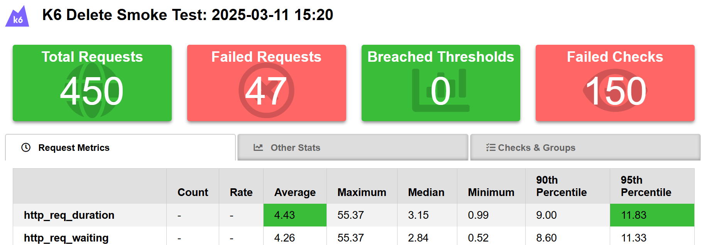

---
### 🚚 Teste de Carga (Load Test):

- **Objetivo:** Avaliar a resposta e a estabilidade da API sob alta demanda.

- **Configuração:**

   - **Usuários Virtuais:** 50 - 150 - 0.

   - **Duração do Teste:** 2 minutos.

- **Métricas e Critérios de Aceitação:**

   - **Tempo de Resposta:** Menor que 100ms.

   - **Tamanho máximo da lista por página:** Máximo de 20 filmes por página.

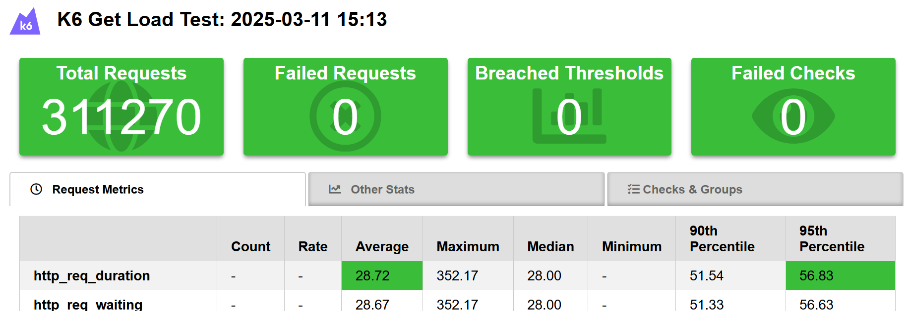

---
### 💢 Teste de Estresse (Stress Test):

- **Objetivo:** Testar os limites da API ServeRest, analisando seu comportamento sob carga extrema.

- **Configuração:**

   - **Usuários Virtuais:** 100 - 350 - 0.

   - **Duração do Teste:** 4 minutos.

- **Métricas e Critérios de Aceitação:**

   - **Tempo de Resposta:** No máximo 300ms.

   - **Solicitações por segundo:** Pelo menos 50 por segundo.

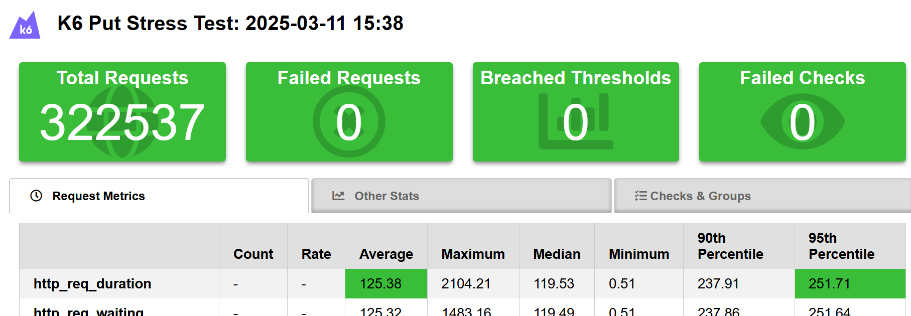

---
### 📈 Teste de Pico (Spike Test):

- **Objetivo:** Avaliar a performance do sistema em condições de picos extremos de carga.

- **Configuração:**

   - **Usuários Virtuais:** 250 - 50.

   - **Duração do Teste:** 1 minuto e 20 segundos.

- **Métricas e Critérios de Aceitação:**

   - **Tempo de Resposta:** No máximo 200ms.

   - **Solicitações por segundo:** Pelo menos 100 por segundo.

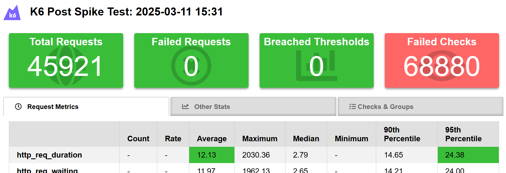

---
### 📎 Teste de Resistência (Soak Test):

- **Objetivo:** Verificar a estabilidade do sistema sob carga contínua por um longo período.

- **Configuração:**

   - **Usuários Virtuais:** 100 - 150 - 0.

   - **Duração do Teste:** 2 minutos e 30 segundos.

- **Métricas e Critérios de Aceitação:**

   - **Tempo de Resposta:** Menor que 50ms

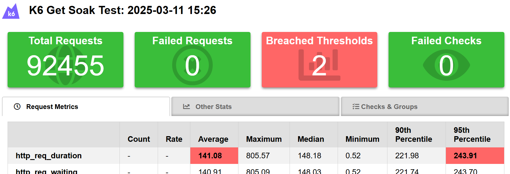
---

### /tickets

### 🌫️ Teste de Fumaça (Smoke Test):

- **Objetivo:** Verificar se as principais funções da API estão operacionais antes de testes mais detalhados.

- **Configuração:**

   - **Usuários Virtuais:** 5.

   - **Duração do Teste:** 30 segundos.

- **Métricas e Critérios de Aceitação:**

   - **Tempo de Resposta:** No máximo 300ms

   - **Solicitações por segundo:** Pelo menos 50 por segundo.

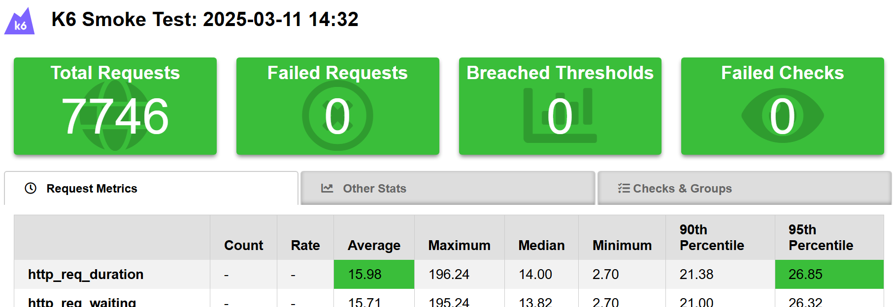

---
### 🚚 Teste de Carga (Load Test):

- **Objetivo:** Avaliar a resposta e a estabilidade da API sob alta demanda.

- **Configuração:**

   - **Usuários Virtuais:** 50 - 150 - 0.

   - **Duração do Teste:** 2 minutos.

- **Métricas e Critérios de Aceitação:**

   - **Tempo de Resposta:** No máximo 300ms.

   - **Solicitações por segundo:** Pelo menos 50 por segundo.

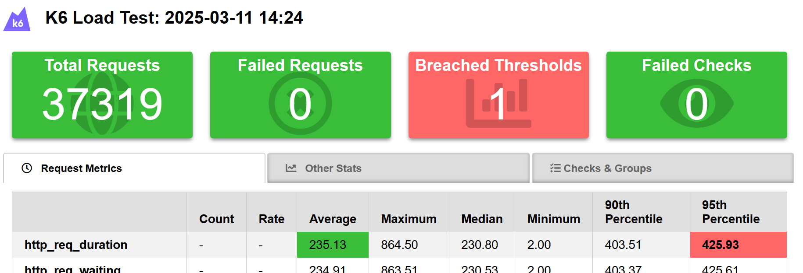

---
### 💢 Teste de Estresse (Stress Test):

- **Objetivo:** Testar os limites da API ServeRest, analisando seu comportamento sob carga extrema.

- **Configuração:**

   - **Usuários Virtuais:** 100 - 350 - 0.

   - **Duração do Teste:** 4 minutos.

- **Métricas e Critérios de Aceitação:**

   - **Tempo de Resposta:** No máximo 300ms.

   - **Solicitações por segundo:** Pelo menos 50 por segundo.

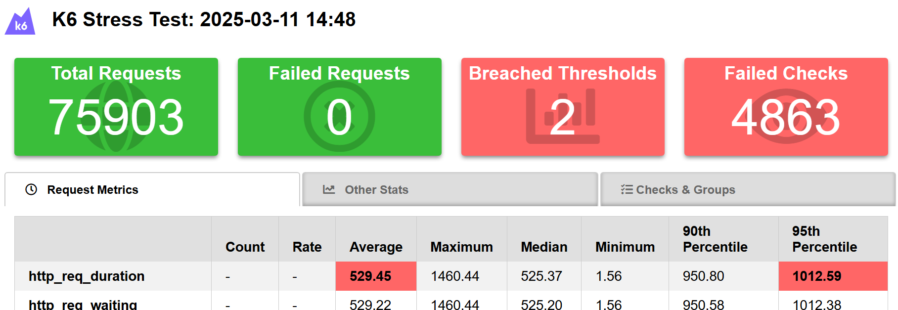

---
### 📈 Teste de Pico (Spike Test):

- **Objetivo:** Avaliar a performance do sistema em condições de picos extremos de carga.

- **Configuração:**

   - **Usuários Virtuais:** 250 - 50.

   - **Duração do Teste:** 1 minuto e 20 segundos.

- **Métricas e Critérios de Aceitação:**

   - **Tempo de Resposta:** No máximo 300ms.

   - **Solicitações por segundo:** Pelo menos 50 por segundo.

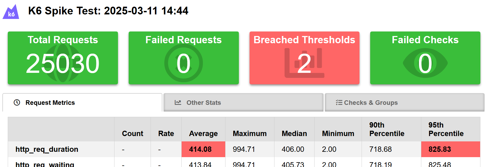

---
### 📎 Teste de Resistência (Soak Test):

- **Objetivo:** Verificar a estabilidade do sistema sob carga contínua por um longo período.

- **Configuração:**

   - **Usuários Virtuais:** 100 - 150 - 0.

   - **Duração do Teste:** 2 minutos e 30 segundos.

- **Métricas e Critérios de Aceitação:**

   - **Tempo de Resposta:** No máximo 300ms.

   - **Solicitações por segundo:** Pelo menos 50 por segundo.

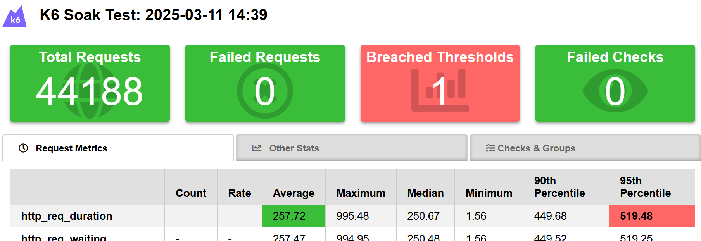

---
### 🔄 Fluxo Completo

Este teste simula o fluxo completo da API, abrangendo desde a criação de filme até a exclusão do mesmo. O processo segue os seguintes passos:

- Criar um filme;
- Listar os filmes;
- Pegar um filme por ID;
- Criar um ticket;
- Excluir um filme.

---
- **Configuração:**

   - **Usuários Virtuais:** 5

   - **Duração do Teste:** 30 segundos.

- **Métricas e Critérios de Aceitação:**

   - **Tempo de Resposta:** Menor que 900ms.

   - **Taxa de Sucesso:** Pelo menos 95%.

   - **Taxa de Erro:** Máximo de 5%.

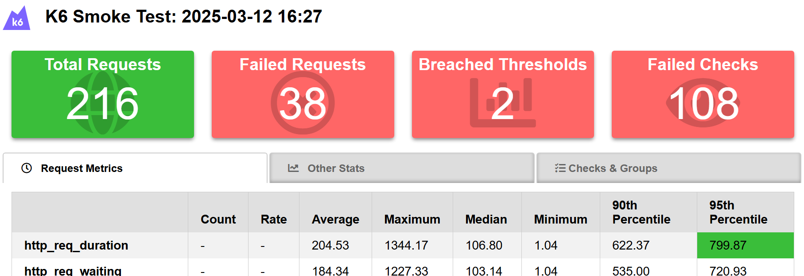